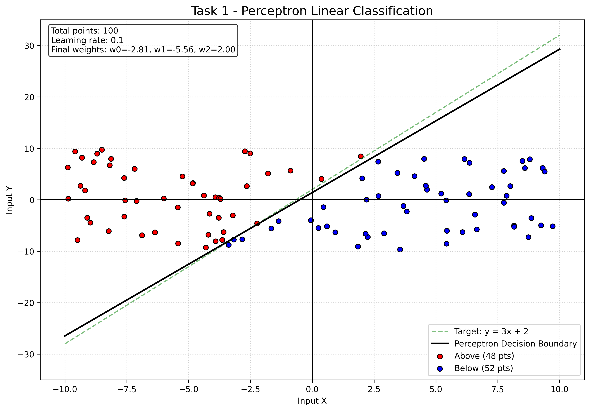

# Unconventional Algorithms & Nature Inspired Computing 

Tento projekt je zaměřen na implementaci a vizualizaci nekonvenčních algoritmů v rámci semestrální práce. Cílem je prozkoumat různé výpočetní modely od neuronových sítí po fraktální geometrii a teorii chaosu.

##  O projektu
Všechny algoritmy jsou implementovány v jazyce **Python** s důrazem na čistotu kódu, modularitu a názornou vizualizaci pomocí knihoven **NumPy** a **Matplotlib**. Každá úloha obsahuje komentáře prokazující pochopení dané problematiky.

---

## 📅 Plán projektu a status odevzdání

| Úloha | Název problému | Status | Body |
| :--- | :--- | :---: | :---: |
| **Task 1** | **Perceptron: point on the line** | ✅ Hotovo | / 3 |
| Task 2 | Simple neural network: XOR problem | 🔄 Probíhá | / 4 |
| Task 3 | Hopfield network | ⏳ Čeká | / 4 |
| Task 4 | Q-learning: Find the cheese | ⏳ Čeká | / 4 |
| Task 6 | L-systems | ⏳ Čeká | / 3 |
| Task 7 | IFS (Iterated Function Systems) | ⏳ Čeká | / 4 |
| Task 8 | Mandelbrot or Julia set | ⏳ Čeká | / 4 |
| Task 9 | 2D country using fractal geometry | ⏳ Čeká | / 4 |
| Task 10 | Theory of chaos: Logistic map | ⏳ Čeká | / 4 |
| Task 12 | Cellular automata: Forest fire | ⏳ Čeká | / 3 |

---

##  Výsledky úloh

### Task 1: Perceptron - Bod na přímce
První úloha demonstruje schopnost jednoduchého perceptronu naučit se lineární separaci dat. Cílem bylo klasifikovat 100 náhodných bodů podle toho, zda leží nad nebo pod přímkou $y = 3x + 2$.

**Dosažené výsledky:**
* **Dataset:** 100 náhodně generovaných bodů v rozsahu $[-10, 10]$.
* **Model:** Jednovrstvý perceptron s Biasem.
* **Vizualizace:** Černá čára představuje naučenou rozhodovací hranici (Decision Boundary), která se úspěšně přiblížila cílové funkci (zelená čárkovaná).

---
